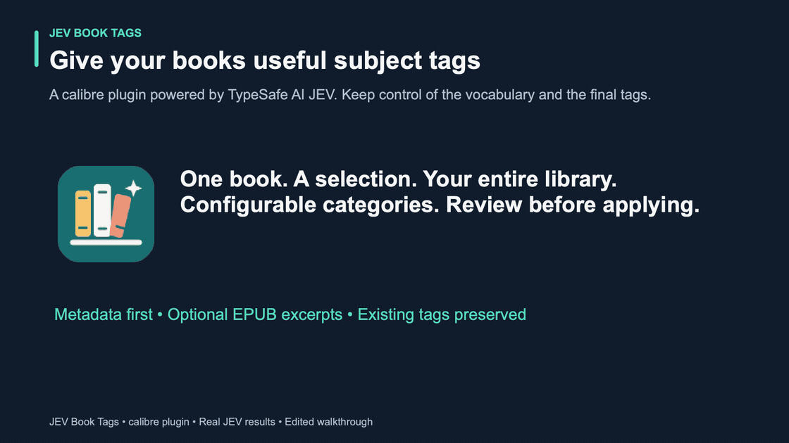
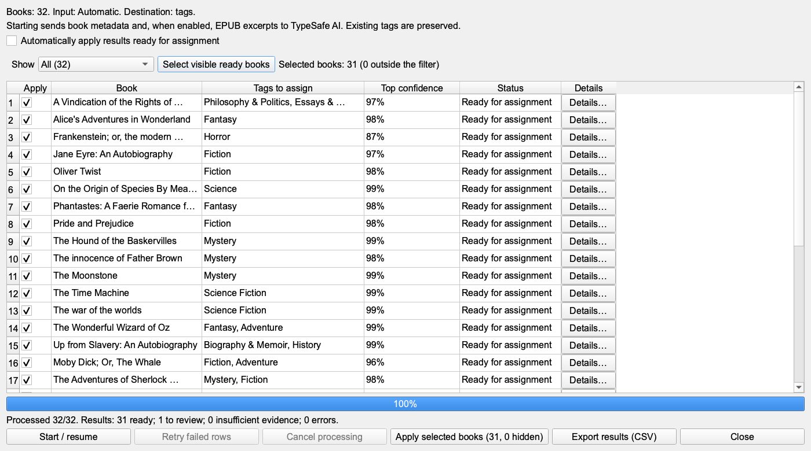
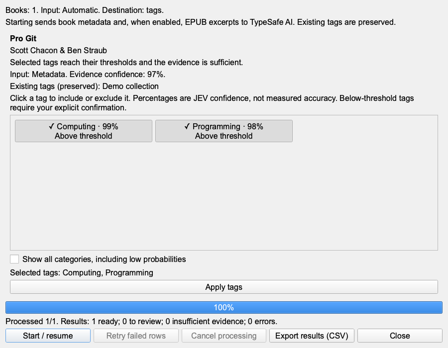
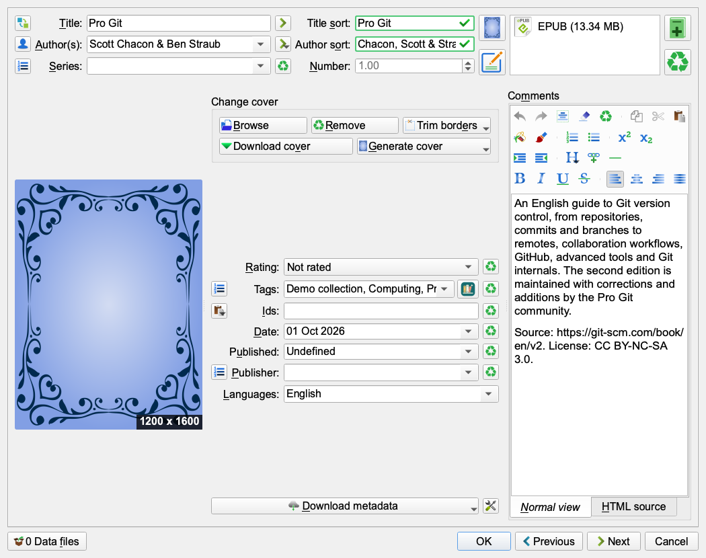

# JEV Book Tags

JEV Book Tags is a calibre plugin that uses TypeSafe AI JEV to suggest subject and genre tags for books in a calibre library. It preserves existing tags and lets you review suggestions before applying them.

**Free and independent:** this plugin is free, open-source software (GPL-3.0-or-later). It is not affiliated with, sponsored by, or endorsed by TypeSafe AI or the calibre project. There are no referral or affiliate links. TypeSafe AI is a separate service: using its API requires your own key and may incur charges.



[Watch the video](docs/media/jev-book-tags-demo.mp4) · [Try the live presentation](https://iamjonatha.github.io/jev-book-tags/) · [Full results and production notes](docs/DEMO.md) · [Import the English demo categories](demo/JEVBookTags-categories-en.json)

The edited walkthrough shows **version 1.1.1** using unchanged **real JEV API responses** for 32 English-language books. Under the current rules, **31 are ready and one requires review**. It demonstrates clickable tags, batch application and a **95% Programming category threshold**, with other categories inheriting 85%. Cached evaluations are reused; no new API calls were made for this media update.

## Features

- Classify the current book, selected books, or the entire open library.
- Choose clickable tags for a single book; filter batch results and open a shared tag-selection detail panel. Review the exact request input before applying results.
- Keep successful evaluations cached, retry failed books, and resume interrupted work.
- Export results as CSV and restore the most recent application when books have not changed since then.
- Configure tag categories, assignment thresholds, input mode, and single-tag or multi-tag behavior.
- Import and export tag vocabularies and complete profiles. Profiles never include API keys.
- Keep technical inspection tools behind an optional developer mode; expand advanced options for model and threshold settings.
- Add a classification button to calibre's metadata editor.
- Follow calibre's interface language when a translation is installed; untranslated strings use the English source text.

## Getting started with TypeSafe AI and Jev

Jev is TypeSafe AI's System One model for structured decisions. Instead of writing a paragraph, it answers typed questions such as yes/no, choose-one, or score, with probabilities your software can use. Read the [official introduction](https://docs.typesafe.ai/introduction) for an overview and the [official quick start](https://docs.typesafe.ai/introduction/quickstart) for examples in the Playground and API.

### Create an account and API key

1. Open the [TypeSafe console](https://console.typesafe.ai). Sign in with Google or enter your email address and choose **Email me a code instead**.
2. In the console, open [API keys](https://console.typesafe.ai/keys) and create a key. Copy it into the plugin's **API key** field in **JEV Book Tags → Settings**. The plugin can keep it for the current calibre session or store it in your operating system's keychain when available. Never commit or share the key.
3. Choose **Test connection** in the plugin settings. The plugin calls TypeSafe's hosted API at `https://api.typesafe.ai/v1/systemone`.

### Credits and cost

> **Free-credit status, checked 1 October 2026:** New TypeSafe accounts currently do **not** receive free signup credits. The earlier **$5** signup-credit offer was temporary (and denominated in US dollars, not euros). On 27 September 2026, TypeSafe said new signups no longer receive free credits and that it hopes to bring them back. Check the [TypeSafe console](https://console.typesafe.ai) and its [official announcement](https://x.com/typesafeai/status/2104337824292220981) for the current offer; do not assume a €5 or $5 balance will be available.

The [official model and pricing page](https://docs.typesafe.ai/models) currently lists Jev at **$0.042 per million input tokens**; output tokens are free. The plugin shows newly used input tokens in its results, but the amount billed and any available credit balance are controlled by TypeSafe. Check the console before processing a large library.

Jev is not a general-purpose text generator: it returns structured decisions and can still classify a book incorrectly, so review uncertain results. This plugin sends book metadata to TypeSafe, and can also send partial EPUB excerpts when that input mode is enabled. TypeSafe's documentation says Jev is not trained on customer requests or responses; review the [Master Customer Agreement](https://typesafe.ai/legal/mca), [Data Processing Addendum](https://typesafe.ai/legal/data-processing), and [official data-handling notes](https://docs.typesafe.ai/models#data-handling) to understand the service terms before sending library content.

## Install

1. Download [JEVBookTags.zip](https://github.com/iamjonatha/jev-book-tags/releases/latest/download/JEVBookTags.zip) from [GitHub Releases](https://github.com/iamjonatha/jev-book-tags/releases). Use the plugin ZIP, not a source-code or media archive.
2. In calibre, open **Preferences → Plugins → Load plugin from file**, choose the ZIP, and restart calibre.
3. Open **JEV Book Tags → Settings**, enter your TypeSafe AI API key, and use **Test connection**.
4. Select a model and configure the categories and input mode. The built-in starter categories are in English; you can edit or replace them.

The repository includes an optional expanded example vocabulary in [`jev-categories.json`](jev-categories.json). Import it from the plugin settings if you want to use those categories; importing replaces the current category list.

The plugin requires calibre 9.0 or newer. The ZIP is built from the files under `plugin/` by `python3 scripts/build.py`.

## Use

Choose **Classify current book**, **Classify selected books**, or **Classify entire library** from the plugin menu. The entire-library option includes books hidden by the current search or virtual library.

A single book opens a clickable tag panel. Batch classification shows a compact list with suggested tags, top confidence, status filters, and a **Details** action. Confirming a detail selection marks it **Verified by you**; closing it discards the local selection. Automatic application is disabled by default. Select books and apply them explicitly. Selections hidden by a filter remain selected and their count is shown before application. Existing manual tags are preserved and duplicates are ignored.

The metadata editor button can appear beside the Tags field, in a dedicated row, or in the bottom button bar. It uses the metadata currently shown in the editor. Suggested tags are saved only when you confirm the metadata dialog with **OK**; **Cancel** discards them.

### Simple and advanced settings

Developer mode is off by default. Enable it in Settings to show **View sent input** and newly used input tokens. **Advanced options** starts collapsed and contains the model, input mode, global threshold, assignment mode, closeness margin, excerpt limit, and category-threshold column. Existing values are retained when controls are hidden. Developer mode is saved per calibre profile, separately from exported classification profiles.

### Assignment modes

- **One tag:** suggest the highest-scoring candidate above 50%. Automatic readiness requires its threshold and no likely alternative within the closeness margin.
- **Multiple tags:** select every category reaching its own threshold. A nearby candidate below its threshold stays optional; it neither gets automatically added nor blocks confident tags. If no category qualifies, close candidates are review-only suggestions.

Defaults: assignment threshold **85%**, closeness margin **8 percentage points**, evidence confidence **80%**. A per-category threshold overrides the global value. Scores must exceed 50% even with a 50% threshold. Meaningful metadata or readable excerpts are also required. Probabilities express model confidence and are not measured classification accuracy. See [the complete decision rules and examples](docs/CLASSIFICATION.md).

### Book data sent to TypeSafe AI

- **Metadata only:** title, authors, description without HTML, language, and series. Existing tags are not sent.
- **Metadata and EPUB excerpts:** adds the table of contents and up to eight samples distributed through the EPUB, up to the configured character limit. The full book file is not sent.
- **Automatic:** includes excerpts immediately when the description has fewer than 200 characters; otherwise it tries metadata first and adds excerpts when review is needed.

EPUB 2 and EPUB 3 are supported for text extraction. PDF, MOBI, and other formats use metadata only. OCR and DRM decryption are not supported. Descriptions are limited to 8,000 characters. Excerpts are read from the saved EPUB, even when metadata has been edited in the open dialog.

Each configured tag is evaluated independently, along with a check for sufficient evidence. Clear inclusion and exclusion rules help classification. Categories may overlap.

### Cache, export, and restore

Successful evaluations are cached per library. Changing the model, input, or category descriptions creates a distinct request; changing thresholds or assignment mode recalculates decisions without another request. Retry failed rows without repeating successful evaluations.

The CSV export includes suggestions, probabilities, input source, effective model, and newly used input tokens. A cached response uses zero new tokens; this does not mean its original request was free. The result summary counts ready, review, insufficient-evidence, and error rows.

Use **View sent input** to inspect the request payload, including partial EPUB excerpts. If book metadata or the EPUB changed after classification, classify it again before inspecting the corresponding input.

**Cancel processing** prevents new requests; the in-flight request completes within its timeout. **Restore last application** restores previous tags only when the book has not changed since the application. Stale previews are blocked when the library or metadata changes.

The local cache and journal are stored in calibre's configuration directory under `plugins/jev_catalog_data/`. They contain book identifiers, tags, and probabilities, but not API keys or book text. Keep the journal if you may need to restore changes. External EPUB edits made during processing are not monitored.

## Screenshots



The preview keeps review-required rows unchecked. A ready result can add multiple tags; existing manual tags are preserved. See the [recorded results and production notes](docs/DEMO.md) for the complete run and media provenance.






## Demo book collection

The repository includes `demo/manifest.json` and `scripts/download_demo_books.py` for preparing a separate test library from Project Gutenberg. Downloaded EPUB files and the generated archive are local artifacts and are excluded from Git. See [demo/README.md](demo/README.md) for details. Project Gutenberg identifies these editions as public domain in the United States; check local requirements before distributing the books elsewhere.

## Help bring JEV Book Tags to more readers

**Speak a language we do not support yet? Help translate the plugin.** English and Italian are available; contributions for other languages are welcome. Copy the interface keys into `translations/<locale>.json`, translate their values, and [submit a translation pull request](https://github.com/iamjonatha/jev-book-tags/compare). See [the translation guide](CONTRIBUTING.md#translations) for locale names, checks and review requirements. If you would like help getting started, [open a translation request](https://github.com/iamjonatha/jev-book-tags/issues/new?template=translation.yml).

**What would make your library easier to manage?** [Suggest a feature](https://github.com/iamjonatha/jev-book-tags/issues/new?template=feature.yml) and describe the book-management problem it would solve. Small ideas and detailed proposals are both welcome; discuss substantial changes before implementing them.

## Contributing

Bug reports, code changes, documentation improvements, and translations are welcome. Read [CONTRIBUTING.md](CONTRIBUTING.md) before opening an issue or pull request. Contributions are reviewed and approved by a maintainer before they are merged.

## Development

Build the installable plugin ZIP:

```sh
python3 scripts/build.py
```

Run the unit tests:

```sh
python3 -m unittest discover -s tests -v
```

The native calibre integration check requires `calibre-debug` and uses a temporary configuration and library. Its service responses are simulated; it does not send books or API keys to TypeSafe AI or modify a user's library. See [CONTRIBUTING.md](CONTRIBUTING.md) for the native check commands.

The project targets calibre 9.0 or newer. Native verification has been performed with calibre 9.13 on macOS; Windows, Linux, and other calibre versions still need platform-specific verification.

## Releases and updates

[GitHub Releases](https://github.com/iamjonatha/jev-book-tags/releases) provides installable ZIPs and changelogs. The `release` branch publishes a new version after automated checks; pushes with an existing version do not replace a published release. See [the maintainer release guide](docs/RELEASING.md). MobileRead registration is deferred, so the plugin is not yet available through calibre’s integrated plugin updater. For now, load the new ZIP over the installed plugin and restart calibre; no uninstall is needed.

## License

This project is licensed under the GNU General Public License v3.0 or later. See [LICENSE](LICENSE).
