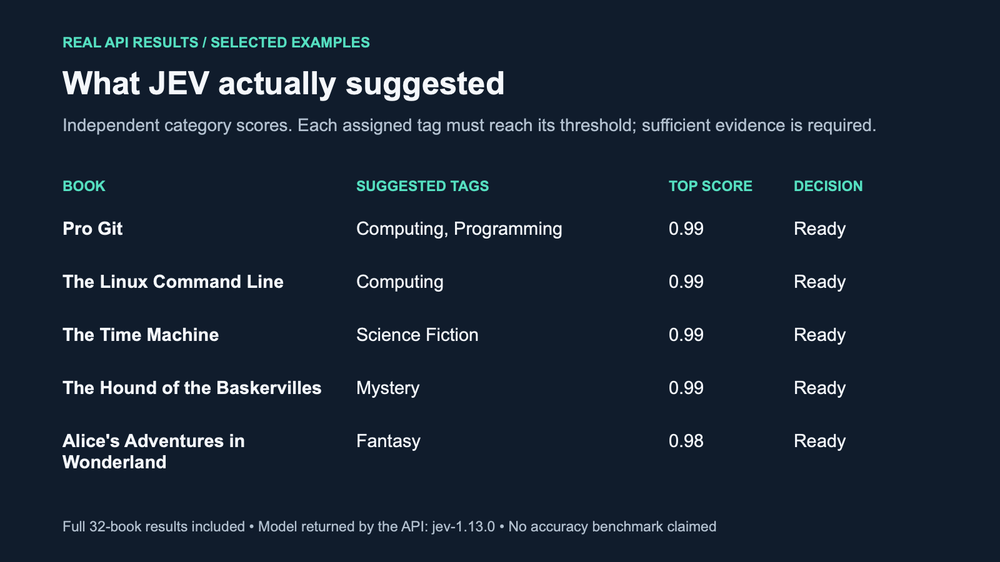
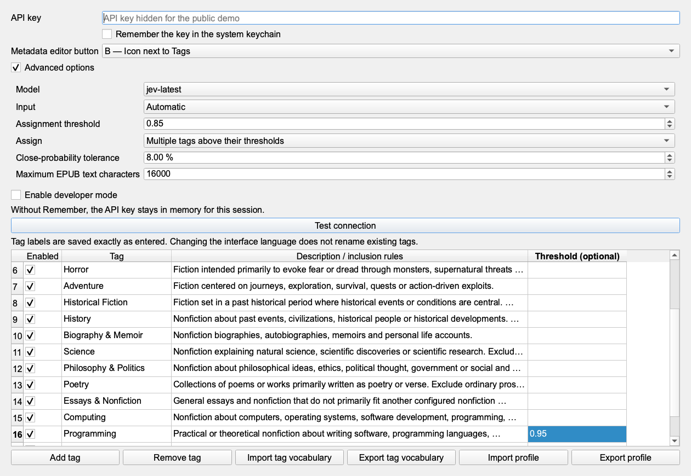

# JEV Book Tags: real API demonstration

[Watch the 76-second video](media/jev-book-tags-demo.mp4) · [Animated preview](media/jev-book-tags-demo.gif) · [Browse the presentation](demo.html)



JEV Book Tags suggests subject and genre tags for one book, a selection, or an entire calibre library. You define the category names and inclusion rules, choose how much book material to send, inspect the probabilities, and decide which suggestions to save. Existing tags are preserved.

## What this demonstration shows

1. Configure the model, categories, threshold, input mode and one-tag or multi-tag behavior.
2. Review suggested tags, evidence, source material and decision status.
3. Apply a ready result while preserving an existing manual tag.
4. Find the plugin icon beside Tags in calibre's native metadata editor.
5. Inspect an auditable result set, including cases that need review.

The video has English on-screen explanations and no audio. The GIF is a shorter preview; use the video or full-resolution images for interface details.

## Recorded run

| Setting | Recorded value |
| --- | --- |
| Plugin / calibre | JEV Book Tags 1.1.1 / calibre 9.13, macOS |
| Date | 1 October 2026 |
| Books | 30 English-language classics and 2 freely licensed technical books |
| Categories | 18 English categories |
| Requested / returned model | jev-latest / jev-1.13.0 |
| Input | Automatic: metadata first, optional partial EPUB text |
| Assignment | Multiple tags, 0.85 threshold, 8 percentage-point closeness margin |
| Result | 31 ready, 1 review required, 0 API errors |
| New API calls / input tokens for this update | 0 / 0: recorded genuine responses reused |
| Original API recording | Version 1.0.3; 246,870 input tokens |
| Category override | Programming: 0.95 (95%); all others inherit 0.85 |

Every classification came from the real TypeSafe AI JEV API. No service response or probability was simulated. The complete results, including review-required cases, are available as [JSON](media/real-results.json) and [CSV](media/real-results.csv).

This is a functional demonstration, not an accuracy benchmark. The same genuine scores from the original API recording are re-evaluated using the current assignment rules. Original responses are preserved in [the historical recording](media/real-results-1.0.3.json); no probability has been modified. The old rule let excluded uncertain categories block confident tags, which explains the earlier 1-ready/31-review result. The current rule considers each selected category's threshold independently.

## Category-specific threshold example

Open **Advanced options**, locate **Programming**, and enter **0.95** in **Threshold (optional)**. This overrides the global 0.85 threshold for that category only. Leave the other cells empty to inherit the global value. Pro Git scores 98% for Programming and receives the tag; The Linux Command Line scores 75% and does not. Neither score is changed by this configuration.



The video shows the empty Programming threshold followed by the configured 0.95 value, using edited native interface captures. It is not a recording of typing into the field. Import [the exact demo vocabulary](media/demo-categories-en.json) to reproduce this override.

| Book | Suggested tags | Decision |
| --- | --- | --- |
| Pro Git | Computing; Programming | Ready |
| The Linux Command Line | Computing | Ready |
| The Time Machine | Science Fiction | Ready |
| The Hound of the Baskervilles | Mystery | Ready |
| Alice's Adventures in Wonderland | Fantasy | Ready |
| The strange case of Dr. Jekyll and Mr. Hyde | Mystery; Horror; Fiction | Review: 84%, 81%, 80%, below 85% |

## How the media was produced

The MP4 and GIF are edited visual walkthroughs, not continuous screen recordings. Interface images are rendered from the plugin's native Qt settings and preview dialogs and calibre's native metadata editor, using the recorded real API evaluations. The explanatory cards are composed around those images. The public API-key field is empty.

The apply example runs the plugin's real application code in a separate copy of the demo library. A deliberately added manual tag, `Demo collection`, demonstrates preservation. The test checks that Pro Git retains that tag and receives `Computing` and `Programming`, while all 31 ready books receive their proposed tags and the one unchecked review book remains unchanged. The added manual tag was not sent as classification evidence. The user's ordinary library and working demo library were not altered by this media run.

Pro Git is an EPUB, so the optional text-extraction path is available. The Linux Command Line is a PDF; the plugin used its title, authors and English description, not PDF text extraction.

## Downloadable configuration and source credits

Import [the English category vocabulary](../demo/JEVBookTags-categories-en.json) through **JEV Book Tags → Settings → Import tag vocabulary**, then save. Importing replaces the current category list. Interface translations do not rename the actual saved tags.

Classic EPUBs come from [Project Gutenberg](https://www.gutenberg.org). The technical books are [Pro Git](https://git-scm.com/book/en/v2), by Scott Chacon and Ben Straub (CC BY-NC-SA 3.0), and [The Linux Command Line](https://linuxcommand.org/tlcl.php), by William Shotts (Seventh Internet Edition, CC BY-NC-ND). These technical books are freely licensed, not public-domain works. The media kit contains no complete book files. Source editions and download URLs are listed in `demo/manifest.json` and `demo/technical/sources.json`.

## Assets and publication

- `media/jev-book-tags-demo.mp4`: 1280 × 720 H.264 video, 76 seconds, silent, with on-screen explanations.
- `media/jev-book-tags-demo.gif`: 1120 × 630 looping preview, 26 seconds.
- `media/banner.png`: repository or release banner.
- `media/settings.png`, `category-threshold.png`, `single-book-tags.png`, `review-results.png`, `review-filter.png`, `review-detail.png`, `apply-results.png`, `metadata-editor.png`: full-resolution native interface images.
- `media/08-examples.png`: readable table derived from recorded results.
- `media/real-results.json` and `real-results.csv`: complete public evaluation data, without API keys or book text.
- `demo.html`: self-contained presentation text and result table, with relative links to the media files. It can be hosted alongside these assets on GitHub Pages.

The README embeds the GIF and links the video. On GitHub, a committed MP4 may appear as a downloadable link; if inline playback is desired, upload the MP4 through GitHub's Markdown editor and use the attachment URL. The repository and installable releases are published on [GitHub](https://github.com/iamjonatha/jev-book-tags); the presentation is available on [GitHub Pages](https://iamjonatha.github.io/jev-book-tags/).

## Reproduce

The current media update uses `prepare_media_results.py` to re-evaluate recorded real responses without API access. It retains a historical copy and exports current decisions separately.

For a fresh API recording, `run_media_demo.py` reads an existing saved API key from the calibre profile specified by `JEV_SOURCE_CONFIG_DIRECTORY`, using its macOS Keychain entry into memory. It never copies the key into the media profile, saves it, or prints it. It sends the isolated demo books to TypeSafe AI using the configured categories. It reuses its local cache on subsequent runs; a cached run is not a new model evaluation. Inspect the code and source profile before using it on another machine.

```sh
export CALIBRE_CONFIG_DIRECTORY="$PWD/demo/media-work/config"
export CALIBRE_OVERRIDE_LANG=en
export QT_QPA_PLATFORM=offscreen
python3 scripts/prepare_media_results.py
/Applications/calibre.app/Contents/MacOS/calibre-debug -e scripts/render_demo_media.py
python3 scripts/build_demo_video.py
python3 scripts/build_demo_page.py
```

The scripts are tailored to the prepared macOS demo environment. Rendering and video construction use recorded data and make no API calls. FFmpeg is required for video construction.
